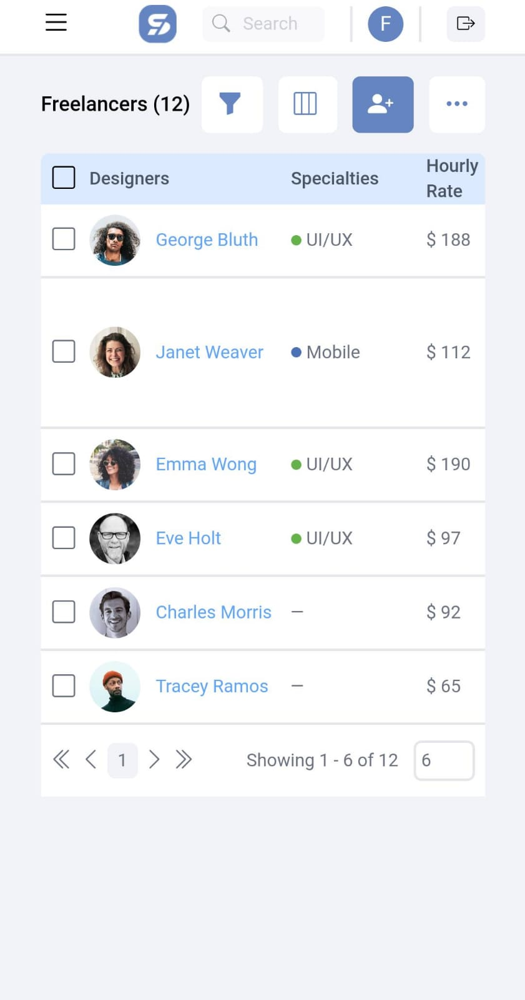

# Test Frontend - UI/UX

This is a solution for the technical test required by a company in the selection process for the position of software developer.

## Table of contents

- [Overview](#overview)
  - [The challenge](#the-challenge)
  - [Screenshot](#screenshot)
  - [Links](#links)
- [My process](#my-process)
  - [Built with](#built-with)
- [Author](#author)

## Overview

### The challenge

The following exercise consists of displaying a list of users; the data will be provided through a request to an API.

The columns to be displayed are:

- Photo
- First Name
- Last Name
- Email

The interface of this listing should be based on the following mockup:

Data source:

PD:

It should be a web interface.
You can carry out the practice using basic tools
- HTML / JS / CSS

Alternatively, if you prefer, you can use a JavaScript framework.
- Preferred:
    - Vuejs + Vuetify
    
    

    - React + MUI
    
    

### Screenshot

### Links

- Solution URL: [Github](https://github.com/SFCC5555/test-frontend-ui-ux)
- Live Site URL: [Freelance Platform](https://freelancers-sfcc.netlify.app/freelancers)

## My process

### Built with

- Semantic HTML5 markup
- CSS custom properties
- Flexbox
- CSS Grid
- Mobile-first workflow
- JavaScript
- Sass
- JSON
- Tailwind
- Bootstrap icons
- React Router V6
- [React](https://reactjs.org/) - JS library

## Author

- [Website](https://sfcc5555.netlify.app/)
- [LinkedIn ](https://www.linkedin.com/in/fernando-carrasco-dev/)
